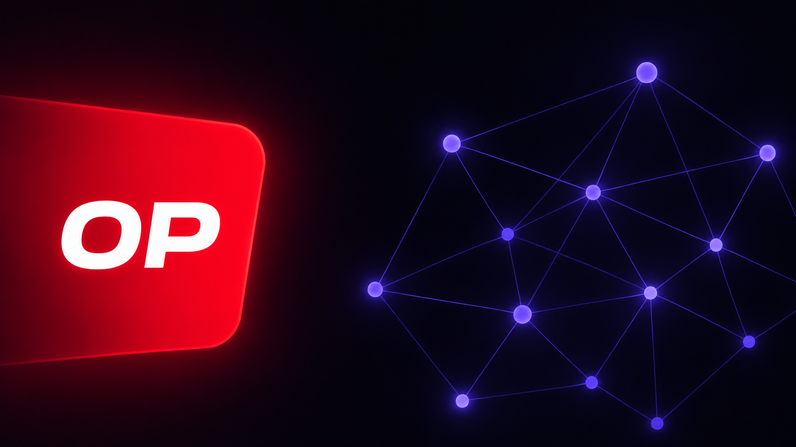
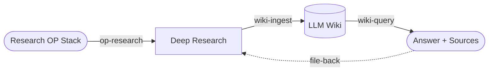

# Optimism LLM Wiki

<p align="center">
  
</p>

<p align="center">
  <strong>Second Brain for Optimism.</strong><br>
  An Graphify knowledge base for Optimism and the OP Stack.<br>
</p>

<p align="center">
  <a href="#what-is-this">What is this?</a> •
  <a href="#getting-started">Getting Started</a> •
  <a href="#work-flow">Work Flow</a> •
  <a href="#how-to-use">How to use</a> •
  <a href="#license">License</a>
</p>

<p align="center">
  <a href="README.md">English</a> |
  <a href="README.ko.md">한국어</a> 
</p>

## What is this

**Optimism LLM Wiki**는 LLM이 직접 쓰고 읽으며 누적·유지하는 OP Stack 엔지니어링 지식베이스입니다.
Andrej Karpathy의 "LLM Wiki"와 Google "Open Knowledge Format"(OKF)을 결합해, 조사·분석한 내용을 출처가 박힌 마크다운 페이지로 컴파일하고 재사용합니다.

### Design rationale
- [`Google OKF`](https://cloud.google.com/blog/products/data-analytics/how-the-open-knowledge-format-can-improve-data-sharing/?hl=en) - This realizes a Google-Requiem-style **centralized, searchable postmortem store** as OKF plain text.
- [`karpathy llm wiki`](https://gist.github.com/karpathy/442a6bf555914893e9891c11519de94f) — A pattern for building personal knowledge bases using LLMs.

## Getting Started

### Dependencies

아래 도구들을 활용해 코드·문서·그래프를 빠르게 연결하면, 더 정확하고 깊이 있는 LLM Wiki를 쌓을 수 있습니다. **시작하기 전에 아래 도구가 설치되어 있어야 합니다**.

| 도구 | 역할 |
|------|------|
| **[Graphify](https://github.com/safishamsi/graphify)** | 위키 페이지를 지식 그래프로 만듭니다. `wiki-query`로 검색하거나 `wiki-ingest`로 교차링크할 때 유사 페이지·관계를 탐색합니다. |
| **[CodeGraph](https://github.com/colbymchenry/codegraph)** | OP Stack 소스를 심볼·호출 그래프로 인덱싱합니다. `op-research`가 코드를 빠르게 훑어 리서치 근거를 모으고, 코드를 정본 삼아 동작을 확인할 때 씁니다. |
| **[Context7](https://github.com/upstash/context7)** | 외부 의존 라이브러리·프레임워크의 최신 문서를 가져옵니다. `op-research`가 문서 트랙 사실을 보강·교차검증할 때 사용합니다. |

### Setup

**1. OP Stack 소스 받기** — Optimism 모노레포를 `resource/`에 내려받습니다.

```
git submodule update --init --recursive
```

**2. 코드 인덱싱** — 받은 소스를 심볼·호출 그래프로 인덱싱합니다. 느린 `grep` 대신 한 번의 질의로 코드를 추적해, 리서치 근거 수집 속도를 끌어올립니다.

```
codegraph init ./resource
```

**3. 위키 그래프 빌드** — 누적된 위키 페이지를 지식 그래프로 만듭니다. 유사 페이지·관계를 미리 연결해 두어야 `wiki-query`가 정확히 찾고 `wiki-ingest`가 중복 없이 교차링크합니다.

```
/graphify ./wiki --wiki
```
> `/graphify`는 llm 스킬입니다. Claude Code 세션을 시작한 뒤 그 안에서 스킬로 호출하세요.

**4. Context7 API 키 설정** — `.mcp.json`의 `CONTEXT7_API_KEY`에 발급받은 키를 넣습니다.

```
"CONTEXT7_API_KEY": "<YOUR_API_KEY>"
```


## Work flow

OP Stack를 조사(`op-research`)하고, 그 결과를 위키 페이지로 기록(`wiki-ingest`)하며, 필요할 때 위키에서 검색(`wiki-query`)합니다.
검색한 답 중 가치 있는 합성은 다시 ingest로 환류(file-back)되어 위키가 계속 누적됩니다.



## How to use

### Research Optimism (OP Stack)

질문을 명확화한 뒤 위키 → 문서 → 코드 3-트랙으로 조사하고, 코드를 정본으로 교차검증해 출처와 함께 종합 보고합니다.

```
/op-research "deposit transaction이 L1에서 L2로 전달되는 과정에 대해 리서치해줘"
```

### LLM Wiki

조사·분석한 내용을 OKF 형식의 위키 페이지로 컴파일합니다. 새 페이지 작성과 함께 `index`·`log`·교차링크를 한 번에 갱신해 정합성을 유지합니다.

```
/wiki-ingest "방금 조사한 deposit transaction 내용을 위키에 반영해줘"
```

위키를 검색해 출처를 인용하며 답합니다. 가치 있는 합성은 다시 ingest로 환류(file-back)해 위키를 누적시킵니다.

```
/wiki-query "fault proof의 dispute game은 어떻게 동작해?"
```

## License

이 프로젝트는 GNU General Public License v3.0을 따릅니다 — 자세한 내용은 [LICENSE](LICENSE)를 참고하세요.