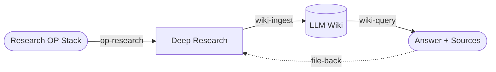

# Optimism LLM Wiki

<p align="center">
  
</p>

<p align="center">
  <strong>Second Brain for Optimism.</strong><br>
  An Graphify knowledge base for Optimism and the OP Stack.<br>
</p>

<p align="center">
  <a href="#what-is-this">What is this?</a> •
  <a href="#getting-started">Getting Started</a> •
  <a href="#work-flow">Work Flow</a> •
  <a href="#how-to-use">How to use</a> •
  <a href="#license">License</a>
</p>

<p align="center">
  <a href="README.md">English</a> |
  <a href="README.ko.md">한국어</a> 
</p>

## What is this

**Optimism LLM Wiki** is an OP Stack engineering knowledge base that an LLM writes, reads, and maintains directly, accumulating knowledge over time.
It combines Andrej Karpathy's "LLM Wiki" with Google's "Open Knowledge Format" (OKF), compiling researched and analyzed findings into source-cited markdown pages for reuse.

### Design rationale
- [`Google OKF`](https://cloud.google.com/blog/products/data-analytics/how-the-open-knowledge-format-can-improve-data-sharing/?hl=en) - This realizes a Google-Requiem-style **centralized, searchable postmortem store** as OKF plain text.
- [`karpathy llm wiki`](https://gist.github.com/karpathy/442a6bf555914893e9891c11519de94f) — A pattern for building personal knowledge bases using LLMs.

## Getting Started

### Dependencies

These tools wire code, docs, and graphs together quickly so you can build a more accurate and in-depth LLM Wiki. **They must be installed before you begin.**

| Tool | Role |
|------|------|
| **[Graphify](https://github.com/safishamsi/graphify)** | Turns wiki pages into a knowledge graph. Explores similar pages and relationships when searching with `wiki-query` or cross-linking with `wiki-ingest`. |
| **[CodeGraph](https://github.com/colbymchenry/codegraph)** | Indexes OP Stack source into a symbol/call graph. `op-research` uses it to skim code quickly for research evidence and to verify behavior against code as the source of truth. |
| **[Context7](https://github.com/upstash/context7)** | Fetches up-to-date docs for external libraries and frameworks. `op-research` uses it to enrich and cross-check facts on the docs track. |

### Setup

**1. Get the OP Stack source** — Download the Optimism monorepo into `resource/`. This is the canonical source that `op-research`'s code track analyzes.

```
git submodule update --init --recursive
```

**2. Index the code** — Index the downloaded source into a symbol/call graph. Instead of slow `grep`, it traces code in a single query, speeding up research-evidence gathering.

```
codegraph init ./resource
```

**3. Build the wiki graph** — Turn the accumulated wiki pages into a knowledge graph. Pre-linking similar pages and relationships is what lets `wiki-query` find things accurately and `wiki-ingest` cross-link without duplicates.

```
/graphify ./wiki --wiki
```
> `/graphify` is an LLM skill. Start a Claude Code session and invoke it as a skill from within.

**4. Set the Context7 API key** — Put your issued key into `CONTEXT7_API_KEY` in `.mcp.json`. The key is required for `op-research`'s docs track to query the latest external library docs.

```
"CONTEXT7_API_KEY": "<YOUR_API_KEY>"
```


## Work flow

Research the OP Stack (`op-research`), record the results as wiki pages (`wiki-ingest`), and search the wiki when needed (`wiki-query`).
Valuable syntheses from those searches are fed back (file-back) into ingest, so the wiki keeps compounding.



## How to use

### Research Optimism (OP Stack)

Clarifies the question first, researches across the wiki → docs → code three tracks, cross-checks against code as the source of truth, and reports back with citations.

```
/op-research "Research how a deposit transaction is relayed from L1 to L2"
```

### LLM Wiki

Compiles researched and analyzed content into OKF-format wiki pages. Alongside creating a new page, it updates `index`, `log`, and cross-links in one pass to keep everything consistent.

```
/wiki-ingest "Reflect the deposit transaction research I just did into the wiki"
```

Searches the wiki and answers with cited sources. Valuable syntheses are fed back (file-back) into ingest to keep the wiki compounding.

```
/wiki-query "How does the fault proof dispute game work?"
```

## License

This project is licensed under the GNU General Public License v3.0 — see [LICENSE](LICENSE) for details.
